# Swift上的問題

## UIImagePickerController\_Test - 有關相機換頁的問題

## PageView\_ReuseController - 有關PageView換頁的問題
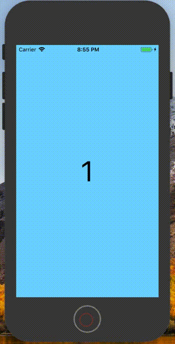

## RotaryWheel - 有關UIControl與UIPanGestureRecognizer的問題
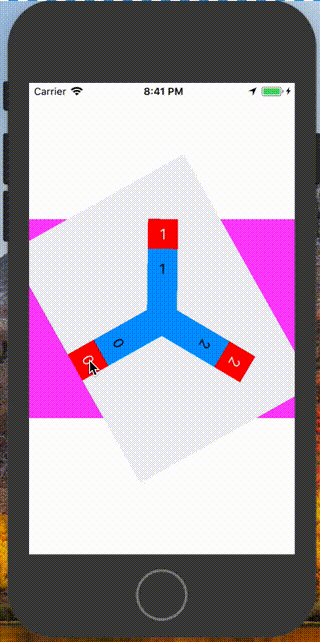

## OpenCV_HelloWorld - 有關OpenCV找人臉的問題
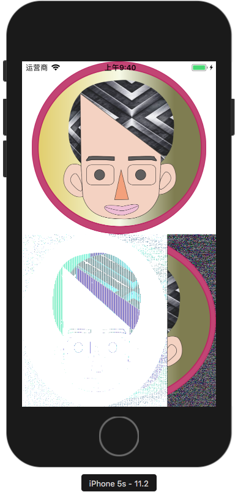

## ContainerView_Demo - 利用ContainerView做側邊選單的問題
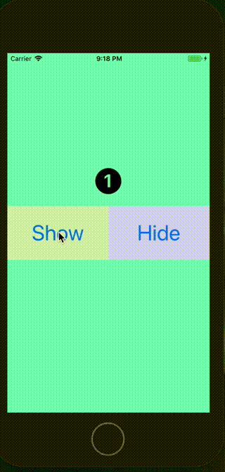

## Gesture_3By3Grid - UIBezierPath碰觸的問題
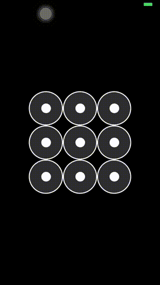

## UIImageCrop - 切圖的問題

## TableViewStretchHeaderImage - NavigitionBar透明度的問題
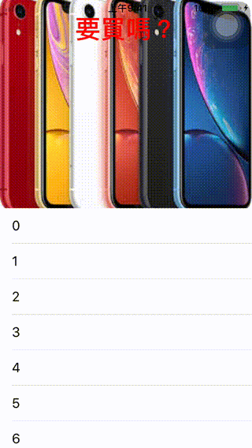

## TextAttachment - UILabel / UITextField / UITextView的圖片文字問題
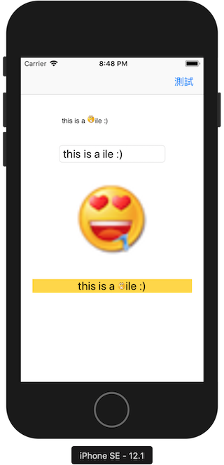

## ImageCombine - 圖片放大、旋轉後，移動不準的問題
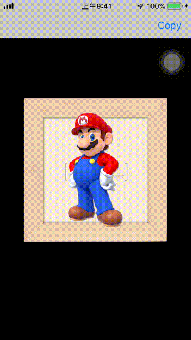

## TableViewTouchButton - 按到TableView背後按鈕的問題
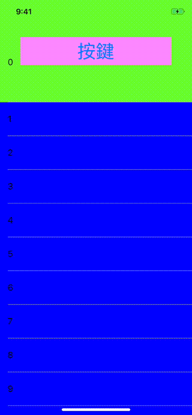

## CoreLocationDemo - CoreLocation在設定頁顯示的問題
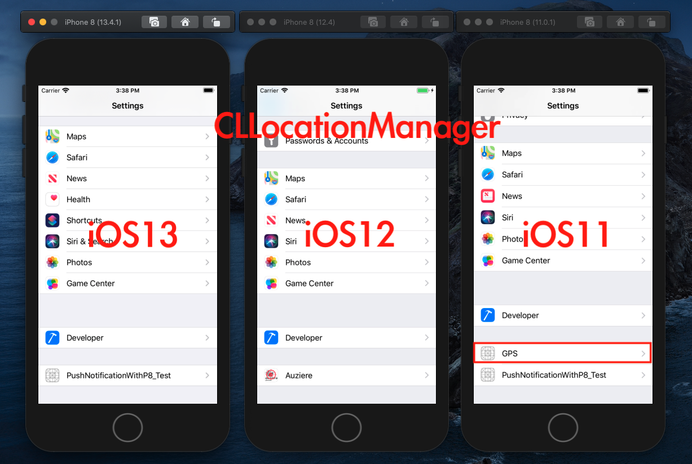

## UICollectionView_HelloWorld - Layout會自動上移 + 點擊沒反應的問題
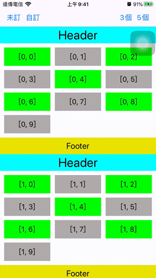
